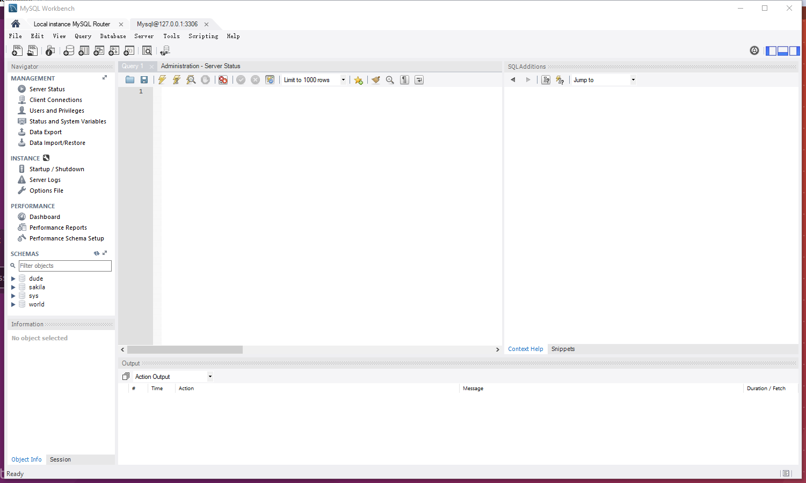
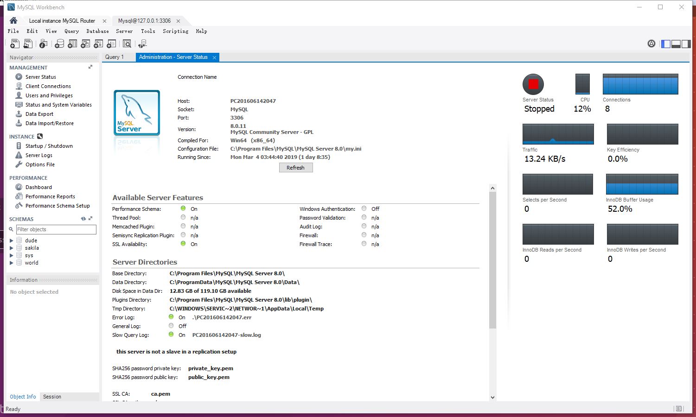

# 数据库系统（2018-2019春夏学期）实验1
```shell
Project Name:   数据库系统的安装和使用
Date        :   2019.03.04
```
## 实验目的
* 通过安装某个数据库管理系统，初步了解DBMS的运行环境
* 了解DBMS的交互界面、图形界面和系统管理工具的使用
* 搭建实验平台

## 实验平台
* 操作系统(win10 pro 64)
* 数据库管理系统(mysql-community-8.0.11.0)

## 实验内容和要求:
### 1.根据某个DBMS的安装说明文档，安装DBMS
在三个平台上都安装过。`Win`和`MacOS`就是去`MySQL`官网上下个包，然后根据GUI界面一步步操作，给默认的`root`用户设置个密码。装完之后记得把添加环境变量似使得令行能够直接访问，然后开启服务即可。  
`linux`下直接在shell中安装：
```sh
sudo apt-get install mysql-server
sudo apt-get install mysql-client
sudo apt-get install libmysqlclient-dev
```
装完后编辑下配置文件，就是看下服务有没有开，端口监听是不是正常，MySQL的默认端口是`3306`。
```sh
sudo netstat -tap | grep mysql
```
另外要设置下远程访问，让网络上的别的电脑能访问这台个数据库。  
先编辑配置文件`vi /etc/mysql/mysql.conf.d/mysqld.cnf`把`bind-address = 127.0.0.1`注释掉。
登陆，shell下用以下命令
```shell
mysql -h localhost -u root -p
```
意思就是指定下你的server的地址(-h)，用哪个用户(-u),用不用密码(-p)，然后输入密码进入这个server就行了。  
然后输入命令设置远程账号的权限(8.0之后原来的写法不能用了，所以用这两条)，就是创建了一个互联网上登陆的用户，然后把权限给这个用户:
```sql
mysql> CREATE USER 'root'@'%' IDENTIFIED BY 'root';
mysql> GRANT ALL PRIVILEGES ON *.* TO 'root'@'%' WITH GRANT OPTION;
```
弄完之后
```sql
flush privileges;
```
退出MySQL，然后在shell下重启
```shell
/etc/init.d/mysql restart
```
然后基本就可以用了吧。(8.0相关的文档比5.7少得多，接口也变了，尤其使win下的path导入，个人感觉用起来很需要勇气)。
### 2.了解DBMS的用户管理
`mysql`登陆用的是`root`用户，用户信息这些保存在`mysql`这个库下面的`user`这个表里面。我们可以看一下这表里面有什么。
```sql
SELECT User,Host from mysql.user;

+------------------+-----------+
| User             | Host      |
+------------------+-----------+
| rust401          | %         |
| shabi            | %         |
| simon            | %         |
| mysql.infoschema | localhost |
| mysql.session    | localhost |
| mysql.sys        | localhost |
| root             | localhost |
+------------------+-----------+
```
因为user这个表的column数量很大，这边就只select两列。一开始自带的用户有mysql开头的3个哥们以及root，然后我们可以创一些本地或者远程可以访问的用户到这个表里面。
```sql
mysql> create user 'root'@'%' IDENTIFIED BY 'Hmf812754';
mysql> grant all privileges on *.* to 'root'@'%' with grant option;
mysql> flush privileges;
```
中间的第二句话给这个用户赋予了所有数据库的所有权限，可以用在库里看一下
```sql
sql> select User,Host, Select_priv,Insert_priv,Update_priv,Delete_priv from user;
```
结果如下
```
+------------------+-----------+-------------+-------------+-------------+-------------+
| User             | Host      | Select_priv | Insert_priv | Update_priv | Delete_priv |
+------------------+-----------+-------------+-------------+-------------+-------------+
| root             | %         | Y           | Y           | Y           | Y           |
| mysql.infoschema | localhost | Y           | N           | N           | N           |
| mysql.session    | localhost | N           | N           | N           | N           |
| mysql.sys        | localhost | N           | N           | N           | N           |
| root             | localhost | Y           | Y           | Y           | Y           |
+------------------+-----------+-------------+-------------+-------------+-------------+
5 rows in set (0.00 sec)
```
`host`这个column是%的话指的是远程用户，如果是localhost的话说明是本地用户才能登陆，后面是一些增删查改的权限。发现给了权限的远程用户`root`的增删查改权限都是`Y`，说明赋权成功了。  
其它的类似于删除用户，修改用户密码的操作都可以直接看官方的document进行查询，这边就不赘述了。
### 3.熟悉交互界面的基本交互命令
官方document都有，这边还是举一个例子吧。有如下场景，我有一张很大的表，以`userID`作为主键，我还有一张小表，里面是部分的`userID`，我想获得第三张表，把大表中`userID`在小表中出现过的行都拿出来弄成一张新表。拍脑袋一想应该是把大表和小表`INNER JOIN`一下选择`Big.userID==small.userID`的行。
下面上流程
```sql
mysql> create database dude;
mysql> use dude;
mysql> CREATE TABLE shabi (user VARCHAR(50), label1 VARCHAR(50), label2 VARCHAR(50), label3 VARCHAR(50), label4 VARCHAR(50),label5 VARCHAR(50), price double(16,4));
mysql> load data local infile '/root/pro/fuckMain.txt' into table shabi;
mysql> CREATE TABLE users (user VARCHAR(50));
mysql> load data local infile '/root/pro/dudes.txt' into table users;
mysql> select shabi.user,shabi.label1,shabi.label2,shabi.label3,shabi.label4,shabi.label5,shabi.price from shabi join users on shabi.user=users.user into outfile '/var/lib/mysql-files/output.txt';
```
先建了个库，然后建了两张表，然后把txt里面的数据分别读到两张表里面。然后把目标数据从表里抓出来放到一个文件夹里面。
我们需要的数据就躺在这张新表里面了。  
  由于mysql的config里面只把`/var/lib/mysql-files/`这个文件夹当成它可以修改的文件夹，所以输出文件指定在这里，不然会报错。如果觉得很麻烦的话可以把安全的授权的文件夹范围改一下。
### 4.熟悉图形界面的功能和操作
有关图形界面，可以看到一些server目前的状态，连接server的用户的统计信息，还可以直接在workbench里面写语句运行。


这里就不过多展开了，摸索下肯定会用。
### 5.了解基本的DBMS管理功能和操作
这部分和上面重复了，我会看document继续学习的，谢谢助教学长评阅！
